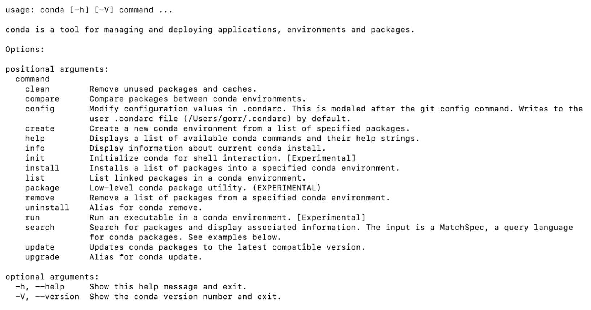

# M1 Chip Troubleshooting Guide
## Overview

In late 2020, Apple released a new processor for use within its products, the M1 chip. The release has created a ripple effect of compatibility issues of certain softwares and technologies when interacting with the M1 Chip. 

This document provides guidance for known issues when using a Mac M1 chip in the FinTech Boot Camp. This document will be updated as new solutions or updates are released or discovered for these topics:

<details>
<summary>Python and Anaconda</summary>

If you have trouble with Python or Anaconda, try installing Miniforge instead of Anaconda:

1. Download ‘Miniforge3-4.10.0-0-MacOSX-arm64.sh’ from https://github.com/conda-forge/miniforge/releases/tag/4.10.0-0 which is the one for the new Apple Silicon architecture.
2. Install it by running the following in the terminal:

    ```
    bash Miniforge3-4.10.0-0-MacOSX-arm64.sh
    ```

3. Accept the licensing/terms and when the installation is complete run the following command in the terminal to verify that it worked:

    ```
    conda
    ```

4. Verify that your  output looks like this:


5. Create a new blank conda environment that uses Python version 3.7 as follows: 

    ```
    conda create --name dev python=3.7 
    ```

6. Activate the newly created environment:

    ```
    conda activate dev
    ```

7. Next you will want to install common additional packages to avoid issues going forward. To do this you will run the following commands: 

    ```
    conda install numpy -y
    conda install pandas -y
    conda install requests -y
    conda install scipy -y
    conda install scikit-learn -y
    conda install matplotlib -y
    conda install -c conda-forge jupyterlab
    ```

8. If you get an error that a library cannot be found, first try to use conda install <library name>, and if that doesn't work, try pip install <library name>

</details>

<details>
<summary>PostgreSQL</summary>

If PostgreSQL will not install properly, the installation can be completed with Homebrew package manager as follows:

1. First verify Homebrew:

    ```
    # verify that the Homebrew package manager is installed
    brew -v                                               
    
    # view helpful commands
    brew -h  
    ```

2. Next, run the initial installation steps as follows:

    ```
    # install PostgreSQL
    brew install postgresql     
    
    # verify PostgreSQL installation
    psql -V            
    
    # get important info about your system-specific postgres homebrew installation
    brew info postgres      
    
    # install pgAdmin
    brew install pgadmin4   

    # start server                                          
    brew services start postgresql

    #create db for pgAdmin
    createdb `database_name`
    
    # required for pgAdmin use
    createuser -s postgres     
    
    # open pgAdmin from the terminal (use the appropriate pathname on your machine)
    open /Application/pgAdmin\ 4.app    
    ```

3. Now you can add Postgres to your path by running the following commands:

    ```
    # add postgres to your path, then open a new terminal instance
    echo "export PGDATA=/opt/homebrew/var/postgres" >> .zshrc
    
    # verify that postgres has been added to your path
    echo $PGDATA      
    ```

4. Next, verify the installation of Postgres via Homebrew:

    ```
    # check server status
    brew services 
    
    # start server                                          
    brew services start postgresql
    
    # stop server                          
    brew services stop postgresql      
    ```

5. If you are still having trouble, try the following:

* In System Preferences > Security & Privacy > Privacy, make sure that postgres has Full Disk Access.

* Then run the following commands:

    ```
    # troubleshooting step a
    rm -rf /opt/homebrew/var/postgres   
    
    # troubleshooting step b
    initdb /opt/homebrew/var/postgres -E UTF-8  

    # if server status is "error", run the next command
    brew services
    
    # if output is "- 1 homebrew.mxcl.postgresql", run the next command
    launchctl list | grep postgresql             
    
    # once you've run this command, restart your machine, then run the next command
    rm ~/Library/LaunchAgents/homebrew.mxcl.postgresql  
    
    # if server status is "stopped", run the next command    
    brew services  
    
    # server status should be "started"                                         
    brew services start postgres
    ```
</details>

<details>
<summary>Tensorflow</summary>

Apple has forked an M1 optimized version of tensorflow that allows tensorflow code to run as is.  To install the M1 optimized version of tensorflow, follow the steps indicated here.

Alternatively, you may open Jupyter Notebooks using Google Colab.
</details>

